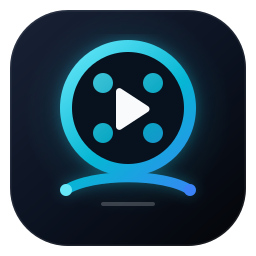
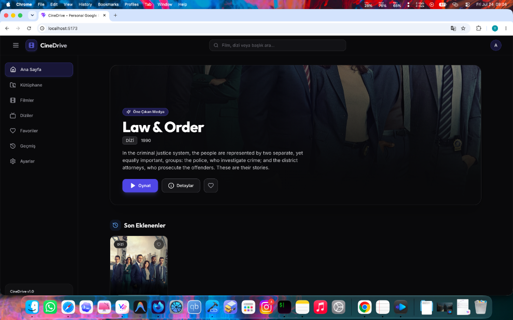

<div align="center">
  

  <h1>CineDrive</h1>

  <p><strong>Your personal cinema and music library, powered by your own storage.</strong></p>

  <p>
    Self-hosted streaming for movies, series, and music from Google Drive or local folders.<br />
    Direct play when possible. On-demand HLS transcoding when needed.
  </p>

  <p><a href="README.tr.md">Türkçe</a> · <strong>English</strong></p>

  <p>
    <a href="https://github.com/yunusemreyazici/CineDrive/actions/workflows/ci.yml"></a>
    <a href="https://github.com/yunusemreyazici/CineDrive/actions/workflows/codeql.yml"></a>
    <a href="https://github.com/yunusemreyazici/CineDrive/actions/workflows/container-security.yml"></a>
    <a href="LICENSE"></a>
    
    
  </p>

  <p>⭐ If CineDrive is useful to you, consider giving the project a star.</p>
</div>

---

<p align="center">
  <a href="#highlights">Highlights</a> ·
  <a href="#quick-start">Quick start</a> ·
  <a href="#configuration">Configuration</a> ·
  <a href="#deployment">Deployment</a> ·
  <a href="#database-backups">Backups</a> ·
  <a href="#contributing-and-security">Contributing</a>
</p>

> [!IMPORTANT]
> CineDrive is under active development. Read the upgrade notes, keep verified database backups, and review configuration changes before updating a production installation.

## Screenshots

| Home                                                   | Media detail                                                      |
| ------------------------------------------------------ | ----------------------------------------------------------------- |
|  |  |

> These screenshots show the movie and series interface. The newer music and maintenance screens are not pictured yet.

## Highlights

### Movies and series

- **Google Drive and local folders** — scan regular folders, Shared Drives, or server-local paths. Drive access uses the read-only OAuth scope.
- **Multiple Drive sources** — connect more than one Google account and manage source folders independently, with per-source scan status and history.
- **Automatic metadata** — artwork, summaries, genres, cast, ratings, age ratings, and trailers from TMDB; TVMaze is used when TMDB is not configured.
- **Library navigation** — full-text search with `⌘K` / `Ctrl+K`, server-side pagination, genre/rating/year filters, and a random picker.
- **Personal state** — favourites, watch history, resume position, completed-state tracking, and automatic next-episode playback.
- **Subtitles** — discover subtitles through OpenSubtitles, upload `.srt` or `.vtt`, adjust timing, and customise their appearance in the player.

### Music

- **Tag-based library** — indexes artists, albums, discs, tracks, genres, release years, credits, and embedded artwork from Drive or local audio files.
- **Discovery** — daily and library-aware mixes, artist/track radio, mood and decade collections, continuous play, and reusable playlists.
- **Replay** — listening statistics by period and year, top artists/albums/tracks, and historical listening summaries.
- **Personal playback** — favourites, history, editable playlists, shuffle/repeat, and an account-synchronised queue and playback position.
- **Lyrics** — sidecar `.lrc` import, LRCLIB lookup, synchronised or plain lyrics, timing alignment, revisions, manual translations, and optional LibreTranslate integration.
- **Audio controls** — ReplayGain loudness normalisation, gapless playback, crossfade, and a five-band equaliser with presets.
- **Library care** — metadata suggestions, bulk editing, duplicate archiving, ReplayGain analysis, Chromaprint/AcoustID matching, and automatic artist artwork discovery.
- **Client sync API** — ETag-aware library sync, batched listening history, download manifests, and authenticated track downloads for mobile/offline clients.

### Platform

- Turkish and English interface languages, seven colour themes, cinema mode, and responsive desktop/mobile navigation.
- User-scoped libraries, favourites, history, playlists, API keys, and encrypted Google refresh tokens.
- Automatic Google access-token refresh and bounded retries for transient Drive failures.
- Storage, codec, FFmpeg job, scan, and database maintenance screens.
- Rate limiting, secure cookies, CORS, Helmet headers, structured logging, and graceful shutdown.

## Playback modes

Every video is probed during a scan. CineDrive stores its container, video codec, audio codec, dimensions, and duration, then creates a browser-specific playback plan.

| Mode     | Behaviour                                                                     |
| -------- | ----------------------------------------------------------------------------- |
| `direct` | The original file is streamed with HTTP Range support; nothing is re-encoded. |
| `audio`  | Video is copied and only the audio track is converted to AAC.                 |
| `hls`    | An HLS stream is generated on demand; compatible tracks can be copied.        |
| `full`   | Video and audio are converted to H.264 + AAC for maximum compatibility.       |

Safari and Chromium may receive different plans for the same file. HLS concurrency and cache size are bounded, and least-recently-used streams are evicted when the cache reaches its quota.

## Architecture

| Layer | Technology                                                           |
| ----- | -------------------------------------------------------------------- |
| Web   | React 19, Vite, React Router, TanStack Query, Zustand, Tailwind CSS  |
| API   | Node.js, TypeScript, Fastify, Zod, Pino                              |
| Data  | Prisma and SQLite with versioned migrations                          |
| Media | Google Drive API, FFmpeg/HLS, `music-metadata`, Chromaprint/AcoustID |
| Tests | Vitest, Testing Library, Playwright                                  |

```text
CineDrive/
├── apps/
│   ├── server/
│   │   ├── prisma/          # Schema and migration history
│   │   ├── scripts/         # Maintenance utilities
│   │   └── src/
│   │       ├── routes/      # Fastify HTTP API
│   │       ├── services/    # Drive, scans, metadata, playback, music, lyrics
│   │       ├── plugins/     # Authentication and Prisma
│   │       └── utils/
│   └── web/
│       └── src/
│           ├── pages/       # Route-level screens
│           ├── features/    # Video and music players
│           ├── components/  # Shared UI
│           └── i18n/        # Turkish and English dictionaries
├── packages/shared/         # Shared types, Zod schemas, and parsers
├── e2e/                     # Isolated Playwright environment
├── nginx/                   # Production reverse proxy
├── scripts/install-vps.sh   # Interactive Debian/Ubuntu installer
└── docker-compose.yml
```

The central ownership path is:

```text
User ──< Library ──< DriveFile ──< Movie / Episode / MusicTrack
  └──< GoogleConnection ──< DriveScanSource
  └──< Favourites / History / Playlists / PlaybackState
```

All media queries and transport endpoints validate that the requested file is reachable through one of the signed-in user's libraries.

## Quick start

### Pick a setup

| Goal                              | Start here                              | Best for                                       |
| --------------------------------- | --------------------------------------- | ---------------------------------------------- |
| Work on CineDrive                 | [Local development](#local-development) | Contributors and feature development           |
| Run it on an existing Docker host | [Docker Compose](#docker-compose)       | Repeatable self-hosting with isolated services |
| Provision a Debian/Ubuntu server  | [VPS installer](#debianubuntu-vps)      | A dedicated host with systemd, Nginx, and TLS  |

All paths require production-quality secrets. Google Drive also requires an OAuth client; local-folder-only installations do not connect to Drive, but the current environment schema still expects syntactically valid placeholder OAuth values.

### Requirements

- Node.js 22.13+ on the Node 22 line, or Node.js 24
- pnpm 11 (the repository is a pnpm workspace)
- OpenSSL for generating secrets
- A Google Cloud OAuth client with the Drive API enabled when using Google Drive
- No separate FFmpeg installation for normal Node/Docker use; `ffmpeg-static` is included
- Optional `fpcalc`/Chromaprint for acoustic fingerprinting

### Google Drive API setup

CineDrive uses a server-side OAuth 2.0 flow. It requests your Google account email and the read-only `drive.readonly` scope so it can discover and stream existing files; it never requests permission to modify Drive content.

1. Open the [Google Cloud Console](https://console.cloud.google.com/), create or select a project, and make sure that project remains selected for the following steps.

2. Enable the Google Drive API:

   - Open **APIs & Services → Library**.
   - Search for **Google Drive API**.
   - Open it and select **Enable**.

   Google also provides a direct [Drive API enablement page](https://console.cloud.google.com/apis/library/drive.googleapis.com).

3. Configure the consent screen under **Google Auth Platform**:

   - **Branding:** set the app name to `CineDrive`, choose a support email, and add a developer contact email.
   - **Audience:** choose **External** for personal Google accounts. A project owned by a Google Workspace organization can use **Internal** when only organization members will connect.
   - **Data Access:** add these exact scopes:

     ```text
     https://www.googleapis.com/auth/drive.readonly
     https://www.googleapis.com/auth/userinfo.email
     ```

   `drive.readonly` is classified by Google as a restricted scope because it can read and download existing Drive files. CineDrive uses it read-only and encrypts the refresh token before storing it.

4. While the app is in **Testing**, add every Google account that will connect to CineDrive under **Audience → Test users**.

   > In Testing mode, Google expires the authorization — including an offline refresh token — after seven days. For a long-running personal installation, switch the publishing status to **In production** after testing. Google allows personal-use apps with fewer than 100 users to remain unverified, but users will see an “unverified app” warning during consent. Public or larger deployments using `drive.readonly` can require Google's restricted-scope verification and security review.

5. Create the OAuth client under **Google Auth Platform → Clients**:

   - Select **Create Client**.
   - Choose **Web application** as the application type.
   - Add the callback that matches your CineDrive installation under **Authorized redirect URIs**:

     ```text
     # Local development
     http://localhost:3000/api/auth/google/callback

     # Production
     https://cinedrive.example.com/api/auth/google/callback
     ```

   Replace the production domain with your own. **Authorized JavaScript origins are not required** because the OAuth code exchange happens on the CineDrive server.

6. Copy the generated values into `.env`:

   ```dotenv
   GOOGLE_CLIENT_ID=your-client-id.apps.googleusercontent.com
   GOOGLE_CLIENT_SECRET=your-client-secret
   GOOGLE_REDIRECT_URI=http://localhost:3000/api/auth/google/callback
   ```

   `GOOGLE_REDIRECT_URI` must exactly match one of the authorized redirect URIs, including the protocol, host, port, path, and whether a trailing slash is present. Use the HTTPS production callback on a deployed server.

7. Restart CineDrive, sign in with the CineDrive administrator account, then open **Settings → Google Drive → Connect Google Drive**. Google connection credentials are managed from Settings; they are not the same as the CineDrive login account.

Never commit `.env`, the OAuth client secret, or downloaded Google credential files. See Google's official guides for [enabling Workspace APIs](https://developers.google.com/workspace/guides/enable-apis), [web-server OAuth](https://developers.google.com/identity/protocols/oauth2/web-server), [Drive scopes](https://developers.google.com/workspace/drive/api/guides/api-specific-auth), and [OAuth audience/publishing status](https://support.google.com/cloud/answer/15549945).

### Local development

1. Clone the repository and install the locked dependencies:

   ```bash
   git clone https://github.com/yunusemreyazici/CineDrive.git
   cd CineDrive
   pnpm install --frozen-lockfile
   ```

2. Create the environment file:

   ```bash
   cp .env.example .env
   openssl rand -hex 32  # SESSION_SECRET
   openssl rand -hex 32  # TOKEN_ENCRYPTION_KEY
   ```

   For local development, change the copied production URLs to:

   ```dotenv
   NODE_ENV=development
   APP_URL=http://localhost:5173
   API_URL=http://localhost:3000/api
   PUBLIC_URL=http://localhost:5173
   GOOGLE_REDIRECT_URI=http://localhost:3000/api/auth/google/callback
   CORS_ORIGIN=http://localhost:5173
   DATABASE_URL="file:./data/app.db"
   TRUST_PROXY=false
   ```

   Paste the generated secrets into `SESSION_SECRET` and `TOKEN_ENCRYPTION_KEY`, then set `ADMIN_EMAIL`, `ADMIN_PASSWORD`, and your Google OAuth credentials. Register the same local callback URL in Google Cloud.

3. Generate Prisma Client and apply migrations:

   ```bash
   pnpm prisma:generate
   pnpm --filter @cinedrive/server prisma:deploy
   ```

   A relative SQLite URL is resolved from `apps/server/prisma/`, so the example above creates `apps/server/prisma/data/app.db`.

4. Start the API and web app:

   ```bash
   pnpm dev
   ```

   - Web: `http://localhost:5173`
   - API: `http://localhost:3000`
   - Liveness check: `http://localhost:3000/api/health`
   - Database readiness check: `http://localhost:3000/api/ready`

The administrator from `ADMIN_EMAIL` and `ADMIN_PASSWORD` is created on first boot. After signing in, connect Drive accounts and create libraries from Settings.

For multiple accounts, set `APP_AUTH_MODE=multi-user`, restart the server, then use Settings → Account to create users and grant listener or editor access to libraries. Playback state is isolated per user and playback client, so web tabs and iOS devices do not overwrite one another.

## Configuration

`.env.example` contains the deployment-oriented defaults. The most important settings are:

| Variable                                       | Purpose                                                                  |
| ---------------------------------------------- | ------------------------------------------------------------------------ |
| `DATABASE_URL`                                 | SQLite URL. Use an absolute path in containers and production.           |
| `SESSION_SECRET`                               | Cookie-signing secret; at least 32 characters.                           |
| `TOKEN_ENCRYPTION_KEY`                         | Exactly 64 hexadecimal characters used to encrypt Google refresh tokens. |
| `GOOGLE_CLIENT_ID`, `GOOGLE_CLIENT_SECRET`     | Google OAuth client credentials.                                         |
| `GOOGLE_REDIRECT_URI`                          | OAuth callback; must exactly match the URL registered with Google.       |
| `ADMIN_EMAIL`, `ADMIN_PASSWORD`                | Initial administrator created on first boot.                             |
| `APP_AUTH_MODE`                                | Use `multi-user` to enable administrator-managed account sign-in.        |
| `METADATA_LANGUAGE`                            | Language used for metadata fetched during future scans; default `tr-TR`. |
| `MUSIC_METADATA_ONLINE`                        | Enables conservative MusicBrainz completion for missing local tags.      |
| `HLS_MAX_ACTIVE_JOBS`                          | Maximum simultaneous HLS encoding jobs.                                  |
| `HLS_CACHE_MAX_BYTES`                          | On-disk HLS cache quota.                                                 |
| `TRANSCODE_MAX_ACTIVE_SESSIONS`                | Maximum simultaneous live compatibility sessions.                        |
| `LIBRETRANSLATE_URL`, `LIBRETRANSLATE_API_KEY` | Optional lyrics translation provider.                                    |
| `FPCALC_PATH`, `ACOUSTID_API_KEY`              | Optional acoustic fingerprinting configuration.                          |

TMDB, OpenSubtitles, and AcoustID keys can be saved per user under **Settings → API management**. Deployment-wide `TMDB_API_KEY`, `OPENSUBTITLES_API_KEY`, and `ACOUSTID_API_KEY` values act as fallbacks.

`METADATA_LANGUAGE` is separate from the interface language. Metadata is written to the database while scanning; changing the variable affects future scans, not existing rows.

## Deployment

### Docker Compose

Create the environment file, replace every example credential and URL, and generate unique values for both secret fields:

```bash
cp .env.example .env
openssl rand -hex 32 # SESSION_SECRET
openssl rand -hex 32 # TOKEN_ENCRYPTION_KEY
```

Paste the generated values into `.env`, configure the administrator and optional Google OAuth credentials, then start the stack:

```bash
docker compose up -d --build
docker compose ps
docker compose logs -f
```

Nginx serves the web app and proxies `/api` to the server on port 80. The server container applies versioned Prisma migrations before starting. Application data, subtitle cache, and Nginx logs live in named volumes.

Tagged releases also publish `linux/amd64` and `linux/arm64` images to GHCR. For a repeatable deployment, use the release Compose override with the immutable digest references attached to the GitHub Release:

```bash
cp release.env.example release.env
docker compose --env-file release.env \
  -f docker-compose.yml -f docker-compose.release.yml pull
docker compose --env-file release.env \
  -f docker-compose.yml -f docker-compose.release.yml up -d --no-build
```

See [Releasing CineDrive](docs/RELEASING.md) for image verification, upgrade, and rollback procedures.

### Debian/Ubuntu VPS

For a fresh VPS, the interactive installer configures a dedicated system user, Node.js, pnpm, FFmpeg, systemd, Nginx, the database, and TLS:

```bash
sudo bash scripts/install-vps.sh
```

The installer supports Cloudflare Origin Certificates, Certbot/Let's Encrypt, or HTTP-only mode. Review the script before running it on an existing server because it writes systemd and Nginx configuration.

### Production checklist

- Serve CineDrive over HTTPS and expose the Nginx entry point, not the API container, to the internet.
- Replace every example password, OAuth secret, `SESSION_SECRET`, and `TOKEN_ENCRYPTION_KEY`; never reuse development credentials.
- Make `APP_URL`, `PUBLIC_URL`, `CORS_ORIGIN`, and the registered Google callback agree exactly with the public origin.
- Use `TRUST_PROXY=true` only behind the included Nginx or another trusted reverse proxy.
- Confirm `docker compose ps` reports the server as healthy, or check `systemctl status cinedrive` on a VPS. Container and VPS startup checks use `/api/ready`, which returns `503` until SQLite can answer; `/api/health` remains a process-only liveness check.
- Keep verified database snapshots outside the application host or Docker volume as part of the backup schedule.

### Upgrades

Before upgrading, create and copy a verified database snapshot outside the application host or Docker volume, and record the currently deployed commit or image tag. Then install locked dependencies, regenerate Prisma Client, apply migrations, and rebuild before restarting the service:

```bash
pnpm install --frozen-lockfile
pnpm prisma:generate
pnpm --filter @cinedrive/server prisma:deploy
pnpm build
```

Migrations are versioned and applied with `prisma migrate deploy`. Do not use `prisma db push` against production. After startup, require `/api/ready` to return `200` and verify sign-in plus one existing library before considering the upgrade complete.

If migration or startup fails, stop CineDrive and preserve the failed database and logs for diagnosis. Roll back the application to the recorded version and restore the pre-upgrade snapshot with the procedure below; an older binary must not be started against a database that newer migrations have already changed. The migration regression suite upgrades populated historical video and music databases, checks SQLite integrity and foreign keys, detects schema drift, and repeats deployment to catch non-idempotent startup behavior.

### Database backups

Create a consistent SQLite snapshot while CineDrive is running. Every snapshot is checked with SQLite's `integrity_check`; the newest 14 are retained by default:

```bash
pnpm db:backup
pnpm db:backup -- --output-dir /secure/cinedrive-backups --retain 30
```

The VPS installer enables `cinedrive-backup.timer`, which runs this verified backup daily and keeps 14 snapshots under `/var/lib/cinedrive/backups`. Docker backups remain inside the application data volume:

```bash
docker compose exec server node apps/server/dist/cli/database-backup.js --retain 14
```

A Docker volume protects against container replacement, not host or disk loss. Copy verified snapshots to storage outside that volume:

```bash
docker compose cp server:/app/data/backups ./cinedrive-backups
```

Restore is a dry run unless `--apply` is present. The dry run verifies the selected file and prints the target. Stop CineDrive before applying a restore; the tool creates an additional pre-restore safety backup and removes stale SQLite WAL sidecars during the atomic replacement.

```bash
pnpm db:restore -- --from /secure/cinedrive-backups/cinedrive-YYYYMMDDTHHMMSSZ.db
# Stop the server, then:
pnpm db:restore -- --from /secure/cinedrive-backups/cinedrive-YYYYMMDDTHHMMSSZ.db --apply
```

## Development commands

```bash
pnpm typecheck      # TypeScript checks in every workspace package
pnpm lint           # ESLint, React hooks, JSX accessibility, React Refresh
pnpm test           # Vitest suites for shared, web, and server
pnpm test:e2e       # Playwright smoke scenarios
pnpm build          # Production builds for shared, server, and web
pnpm db:backup      # Create and verify a retained SQLite snapshot
pnpm db:restore     # Verify a backup; requires --apply to restore it
pnpm release:check  # Validate lockstep SemVer and changelog metadata
pnpm format         # Format TypeScript, JSON, and Markdown with Prettier
```

CI runs typecheck, tests, and production builds at the supported Node 22.13 floor and on Node 24. It also starts the production Docker Compose stack and probes the API through Nginx; Playwright runs after the primary verification succeeds. A separate least-privilege workflow scans both production images for fixable high/critical vulnerabilities and retains CycloneDX SBOMs as build artifacts. Release pull requests dry-run both target architectures; `v*` tags publish provenance-attested, keyless-signed GHCR images plus SBOMs and immutable digest manifests. Dependabot keeps the digest-pinned base images and SHA-pinned actions current.

The E2E suite runs in Chromium and WebKit and checks real video playback advancement, forward/backward seeking, and server-persisted resume after reload. Install both browsers with `pnpm exec playwright install --with-deps chromium webkit`; run one with `pnpm test:e2e --project=chromium` or `--project=webkit`. CI uses Linux for Chromium and macOS for WebKit, and the required `e2e` check passes only when both suites succeed. Media codec availability varies by platform: [Playwright WebKit](https://playwright.dev/docs/browsers#webkit) is not branded Safari or a real iOS device test. Run WebKit playback checks on macOS for the closest Safari coverage.

The HLS suite (`pnpm test:e2e e2e/hls.spec.ts`) generates a real H.264/PCM MKV fixture that requires compatibility playback on both browsers. It checks manifest and segment delivery, forward/backward seeks beyond the generated window with correct absolute playback time, and prompt FFmpeg process termination when leaving the player or replacing a seek window. A test-only local proxy injects HTTP 503 responses into actual HLS requests, including WebKit's native media requests: coverage includes a failed segment, sustained interruption, position preservation, pause during recovery, bounded failure, and manual retry. These are controlled transport failures, not real Wi-Fi/cellular handover tests. The API, media, database and cwd-relative caches are isolated from development data.

HLS recovery makes at most three application-level retries, delayed by 1, 2, and 4 seconds, with a 30-second deadline once recovery begins. A stall without playable buffered data is detected after 12 seconds. Recovery preserves the current stream position and playback intent; a paused video stays paused. After exhaustion, use **Retry stream** once the connection is available. The retry budget resets after sustained playback, a source change, or an explicit manual retry. Direct video and music playback use separate recovery paths.

## Troubleshooting

- **The local login redirects or the cookie is not saved:** confirm `NODE_ENV=development`, the localhost URLs above, and `TRUST_PROXY=false`.
- **Google rejects the OAuth callback:** `GOOGLE_REDIRECT_URI` must be identical in `.env` and the Google Cloud OAuth client.
- **A scan finishes with missing files:** inspect the library source and scan history under Settings. Failed items retain their error and can be analysed again.
- **A title plays in Chromium but not Safari:** this is usually a container/audio-codec difference. Settings → Storage and media health shows the playback plan for each browser.
- **Playback waits before starting:** inspect active FFmpeg jobs and the queue. Increase `HLS_MAX_ACTIVE_JOBS` only when the host has enough CPU and memory.
- **Music metadata is incomplete:** check embedded tags first, then run Music library care suggestions. MusicBrainz completion never overrides authoritative local tags automatically.
- **Lyrics translation is unavailable:** configure `LIBRETRANSLATE_URL`; lyric lookup itself does not require LibreTranslate.

## Contributing and security

- Review the [changelog](CHANGELOG.md) and [release policy](docs/RELEASING.md) before preparing a version.
- Use the [issue templates](https://github.com/yunusemreyazici/CineDrive/issues/new/choose) for reproducible bugs and focused feature requests.
- Read [CONTRIBUTING.md](CONTRIBUTING.md) before submitting code; it lists the required checks and repository conventions.
- Do not report vulnerabilities in a public issue. Follow [SECURITY.md](SECURITY.md) to use GitHub's private vulnerability reporting channel.

## License

CineDrive is available under the [MIT License](LICENSE).
