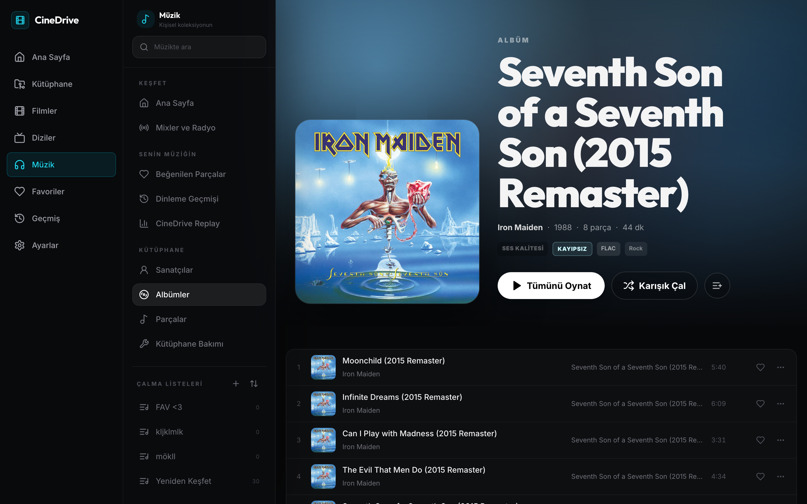
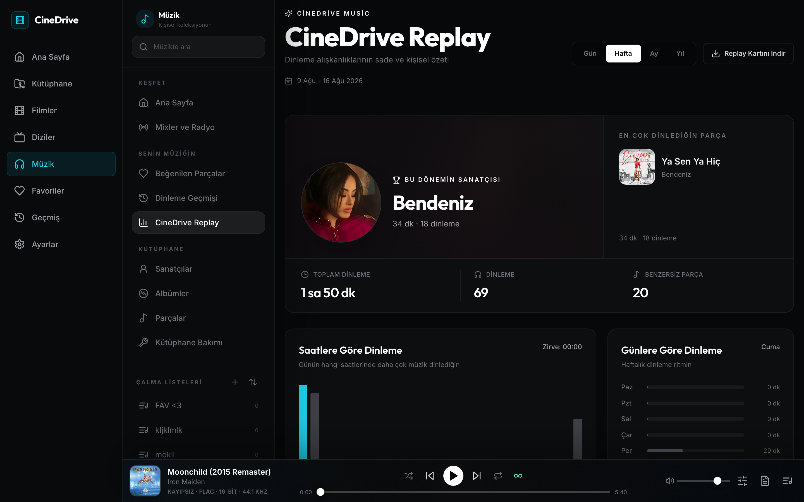
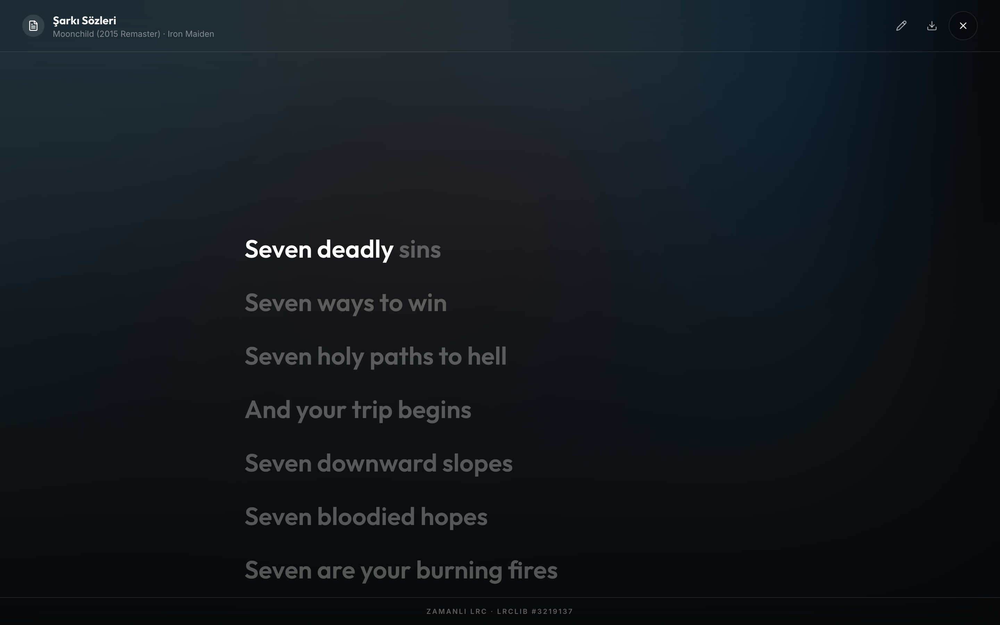
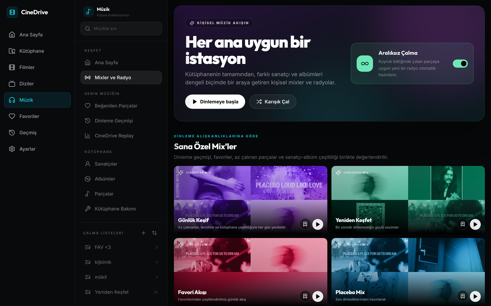
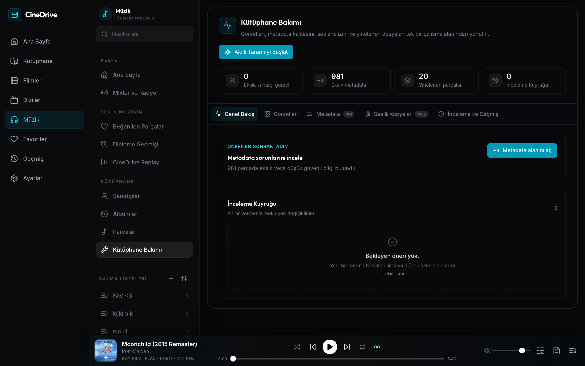
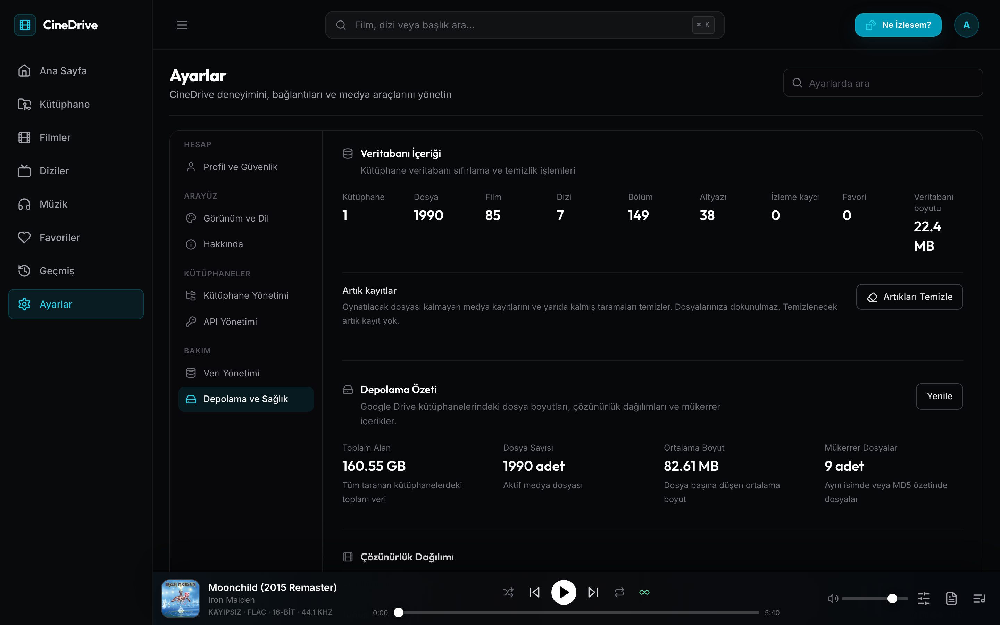

<div align="center">
  

  <h1>CineDrive</h1>

  <p><strong>Filmleriniz, dizileriniz ve müzikleriniz. Kendi depolamanız. Kendi sunucunuz.</strong></p>

  <p>
    Google Drive veya yerel klasörlerdeki film, dizi ve müzikler için kendi sunucunuzda yayın.<br />
    Mümkün olduğunda doğrudan oynatma, gerektiğinde isteğe bağlı HLS dönüşümü.
  </p>

  <p><strong>Türkçe</strong> · <a href="README.md">English</a></p>

  <p>
    <a href="https://github.com/yunusemreyazici/CineDrive/actions/workflows/ci.yml"></a>
    <a href="https://github.com/yunusemreyazici/CineDrive/actions/workflows/codeql.yml"></a>
    <a href="https://github.com/yunusemreyazici/CineDrive/actions/workflows/container-security.yml"></a>
    <a href="LICENSE"></a>
    
    
  </p>

</div>

<p align="center">
  <a href="#neden-cinedrive">Neden CineDrive?</a> ·
  <a href="#ekran-görüntüleri">Ekran görüntüleri</a> ·
  <a href="#özellikler">Özellikler</a> ·
  <a href="#hızlı-başlangıç">Başlayın</a> ·
  <a href="#dokümantasyon">Dokümantasyon</a>
</p>

## Neden CineDrive?

**CineDrive, Google Drive veya sunucudaki yerel klasörleri film, dizi ve müzik için kişisel bir yayın kütüphanesine dönüştürür.** Dosyalarınız yerinde kalsın; afişlerle kütüphanenizi gezin ve kaldığınız yerden devam edin.

Uygulama ve veritabanı kendi sunucunuzda çalışır. Google Drive isteğe bağlı bir depolama kaynağıdır; yerel kütüphaneler için zorunlu değildir.

| Kimler için?              | Neler sunar?                                                                          |
| ------------------------- | ------------------------------------------------------------------------------------- |
| ☁️ Google Drive arşivleri | Birden fazla Google hesabı, normal klasörler, Ortak Sürücüler ve salt okunur erişim.  |
| 💾 Yerel medya            | Koleksiyonunuzu yeni bir depolama hizmetine taşımadan sunucudaki klasörleri kullanma. |
| 🎬 Film geceleri          | Metadata, altyazılar, kaldığı yerden devam ve tarayıcıya göre uyumluluk oynatması.    |
| 🎵 Müzik koleksiyonunuz   | Albümler, mix'ler, radyo, şarkı sözleri, Replay istatistikleri ve kalıcı sıra.        |
| 🛠️ Kütüphane bakımı       | Metadata düzenleme, mükerrer arşivleme, akustik eşleştirme ve medya sağlığı araçları. |
| 🔐 Self-hosting           | Kendi sunucunuz ve veritabanınız, kullanıcıya özel erişim ve MIT lisanslı kod.        |

## Ekran görüntüleri

| Film ve diziler                                               | Medya detayları                                                      |
| ------------------------------------------------------------- | -------------------------------------------------------------------- |
|  |  |

| Müzik kütüphanesi                                                    | Dinleme istatistikleri                                 |
| -------------------------------------------------------------------- | ------------------------------------------------------ |
|  |  |

<details>
<summary>Daha fazlası: şarkı sözleri, mix'ler, kütüphane bakımı ve medya sağlığı</summary>

| Senkronize sözler                                                     | Mix'ler ve radyo                                      |
| --------------------------------------------------------------------- | ----------------------------------------------------- |
|  |  |

| Kütüphane bakımı                                                    | Depolama ve medya sağlığı                                                  |
| ------------------------------------------------------------------- | -------------------------------------------------------------------------- |
|  |  |

</details>

Ekran görüntüleri Türkçe arayüzü gösterir; İngilizce de kullanılabilir.

## Özellikler

### Film ve diziler

- **Google Drive ve yerel klasörler** — normal klasörleri, Ortak Sürücüleri veya sunucudaki yerel yolları tarayın. Drive erişimi salt okunur OAuth kapsamını kullanır.
- **Birden fazla Drive kaynağı** — birden fazla Google hesabı bağlayın; kaynak klasörlerini, tarama durumunu ve geçmişini ayrı ayrı yönetin.
- **Otomatik metadata** — TMDB'den görseller, özet, tür, oyuncu kadrosu, puan, yaş sınırlaması ve fragman; TMDB ayarlı değilse TVMaze yedeği.
- **Kütüphane gezintisi** — `⌘K` / `Ctrl+K` ile arama, sunucu tarafında sayfalama, tür/puan/yıl filtreleri ve rastgele içerik seçici.
- **Kişisel durum** — favoriler, izleme geçmişi, kaldığın yerden devam, tamamlandı takibi ve sonraki bölüme otomatik geçiş.
- **Altyazı** — OpenSubtitles üzerinden arama, `.srt` veya `.vtt` yükleme, zaman kaydırma ve oynatıcı içinde görünüm ayarları.

### Müzik

- **Etiket tabanlı kütüphane** — Drive veya yerel ses dosyalarından sanatçı, albüm, disk, parça, tür, yayın yılı, katkıda bulunanlar ve gömülü görselleri indeksler.
- **Keşif** — günlük ve kütüphaneye özel mix'ler, sanatçı/parça radyosu, ruh hâli ve dönem koleksiyonları, kesintisiz oynatma ve kaydedilebilir çalma listeleri.
- **Replay** — dönem ve yıla göre dinleme istatistikleri, en çok dinlenen sanatçı/albüm/parçalar ve geçmiş dinleme özetleri.
- **Kişisel oynatma** — beğeniler, geçmiş, düzenlenebilir çalma listeleri, karıştırma/tekrarlama ve hesapta eşzamanlanan kuyruk ile oynatma konumu.
- **Şarkı sözleri** — yan dosya `.lrc` içe aktarma, LRCLIB araması, senkronize veya düz sözler, zaman hizalama, revizyonlar, elle çeviri ve isteğe bağlı LibreTranslate entegrasyonu.
- **Ses ayarları** — ReplayGain ses yüksekliği normalizasyonu, boşluksuz oynatma, crossfade ve hazır ayarlı beş bant ekolayzır.
- **Kütüphane bakımı** — metadata önerileri, toplu düzenleme, mükerrerleri arşivleme, ReplayGain analizi, Chromaprint/AcoustID eşleştirmesi ve otomatik sanatçı görseli bulma.
- **İstemci eşzamanlama API'si** — mobil/çevrimdışı istemciler için ETag destekli kütüphane eşzamanlama, toplu dinleme geçmişi, indirme manifesti ve kimlik doğrulamalı parça indirme.

### Platform

- Türkçe ve İngilizce arayüz, yedi renk teması, sinema modu ve masaüstü/mobil uyumlu gezinti.
- Kullanıcıya göre ayrılmış kütüphaneler, favoriler, geçmiş, çalma listeleri ve API anahtarları; şifrelenmiş Google yenileme belirteçleri.
- Otomatik Google erişim belirteci yenileme ve geçici Drive hataları için sınırlı yeniden deneme.
- Yalnızca yöneticilere açık CPU, bellek, disk I/O, ağ, sıcaklık ve yedi günlük bant genişliği takibi; codec, FFmpeg işi, tarama ve veritabanı bakım ekranları.
- İstek sınırlama, güvenli çerezler, CORS, Helmet başlıkları, yapılandırılmış log ve kontrollü kapanış.

Direct/audio/HLS/full modları, tarayıcı farkları, kalite kontrolleri ve sınırlı akış toparlanması için [oynatma rehberini](docs/PLAYBACK.tr.md) okuyun.

## Hızlı başlangıç

| Amacınız                                   | Buradan başlayın                                                     |
| ------------------------------------------ | -------------------------------------------------------------------- |
| Mevcut Docker sunucusunda çalıştırmak      | Aşağıdaki Docker hızlı başlangıcı                                    |
| Sürümlenmiş container image'ları kullanmak | [Doğrulanmış release image'ları](docs/RELEASING.tr.md)               |
| Özel Debian/Ubuntu VPS hazırlamak          | [VPS kurucusu](docs/INSTALLATION.tr.md#debianubuntu-vps)             |
| Yerelde geliştirmek                        | [Node.js ve pnpm kurulumu](docs/INSTALLATION.tr.md#yerel-geliştirme) |

### Docker Compose

Docker Compose ve OpenSSL gerektirir. Komutları repo dizininden çalıştırın:

```bash
git clone https://github.com/yunusemreyazici/CineDrive.git
cd CineDrive
cp .env.example .env
openssl rand -hex 32 # SESSION_SECRET üretin
openssl rand -hex 32 # TOKEN_ENCRYPTION_KEY için ayrı değer üretin
```

Başlatmadan önce `.env` dosyasını düzenleyin:

- İki anahtarı yapıştırın; kendi yönetici e-posta ve parolanızı belirleyin.
- Public URL'leri, CORS origin'ini ve callback'i dağıtımınıza göre ayarlayın.
- Drive kütüphaneleri için [Google Drive kurulumunu](docs/GOOGLE_DRIVE.tr.md) izleyin.
- Yalnızca yerel kullanımda OAuth placeholder'larını boş bırakmayın; medya dizinini [Kurulum](docs/INSTALLATION.tr.md#dockerda-yerel-medya) belgesindeki gibi server container'ına bağlayın.
- TMDB anahtarınız yoksa değeri boş bırakın: `TMDB_API_KEY=`.

```bash
docker compose up -d --build
docker compose ps
```

Nginx 80 numaralı portu dinler. Belirlediğiniz yönetici hesabıyla giriş yapıp Ayarlar'dan kütüphane oluşturun. Servisi internete açmadan önce HTTPS yapılandırın; [production kontrol listesine](docs/OPERATIONS.tr.md#production-kontrol-listesi) bakın.

Bu hızlı başlangıç kaynak koddan derler. Yerel derleme gerektirmeyen tekrarlanabilir dağıtım için [release Compose override'ını ve doğrulanmış image digest'lerini](docs/RELEASING.tr.md) kullanın.

### Başlamadan önce

- **Runtime:** kaynak kurulumları pnpm 11 ile Node.js 22 serisinde 22.13+ veya Node.js 24 destekler. Docker için host'ta Node gerekmez.
- **Medya işleme:** normal Node/Docker kurulumlarında FFmpeg dahildir; Chromaprint isteğe bağlıdır.
- **Hesaplar:** yerel medya için Google bağlantısı gerekmez. CineDrive uygulama girişi yine zorunludur.
- **Çoklu kullanıcı:** yönetici tarafından oluşturulan hesapları ve kütüphane rollerini [Yapılandırma](docs/CONFIGURATION.tr.md#çok-kullanıcılı-mod) üzerinden etkinleştirin.
- **Güncellemeler:** proje aktif geliştirme aşamasındadır. Doğrulanmış host dışı yedekler tutun ve güncellemeden önce sürüm notlarını okuyun.

## Dokümantasyon

Bütün kurulum ve işletim ayrıntılarını tek sayfada okumak yerine ihtiyacınız olan rehberi seçin:

| Rehber                                   | Kapsam                                                                                  |
| ---------------------------------------- | --------------------------------------------------------------------------------------- |
| [Kurulum](docs/INSTALLATION.tr.md)       | Docker, yerel medya mount'ları, VPS kurucusu ve yerel geliştirme                        |
| [Yapılandırma](docs/CONFIGURATION.tr.md) | Ortam değişkenleri, API anahtarları, kaynak sınırları ve çoklu kullanıcı                |
| [Google Drive](docs/GOOGLE_DRIVE.tr.md)  | OAuth istemcisi, salt okunur kapsamlar, callback URL'leri ve sorun giderme              |
| [Oynatma](docs/PLAYBACK.tr.md)           | Video modları, altyazılar, müzik, HLS toparlanması ve tarayıcı kapsamı                  |
| [Operasyon](docs/OPERATIONS.tr.md)       | HTTPS, sağlık kontrolleri, loglar, güncelleme, yedekleme, geri yükleme ve sorun giderme |
| [Geliştirme](docs/DEVELOPMENT.tr.md)     | Mimari, komutlar, testler, CI ve katkı akışı                                            |
| [Sürümleme](docs/RELEASING.tr.md)        | SemVer, GHCR image'ları, imzalar, SBOM ve release geri dönüşü                           |

Her rehberin başında İngilizce/Türkçe dil bağlantısı bulunur.

## Katkı ve güvenlik

Katkılarınızı, tekrarlanabilir hata raporlarını ve odaklı özellik isteklerini bekliyoruz.

- İş akışı ve gerekli kontroller için [CONTRIBUTING.md](CONTRIBUTING.md) dosyasını okuyun.
- Değişiklikler ve güncelleme bağlamı için [CHANGELOG.md](CHANGELOG.md) dosyasını inceleyin.
- Hata ve özellik önerileri için [issue açın](https://github.com/yunusemreyazici/CineDrive/issues/new/choose).
- Güvenlik açıklarını public bildirmeyin; [SECURITY.md](SECURITY.md) yönergelerini izleyin.

## CineDrive'ı destekleyin

CineDrive işinize yarıyorsa depoya yıldız verin, diğer self-hosting meraklılarıyla paylaşın veya odaklı bir iyileştirmeyle katkıda bulunun.

## Lisans

CineDrive, [MIT Lisansı](LICENSE) altında sunulur.

<p align="center"><strong>Medyanız. Depolamanız. Sunucunuz.</strong><br /><a href="#cinedrive">Başa dön</a></p>
